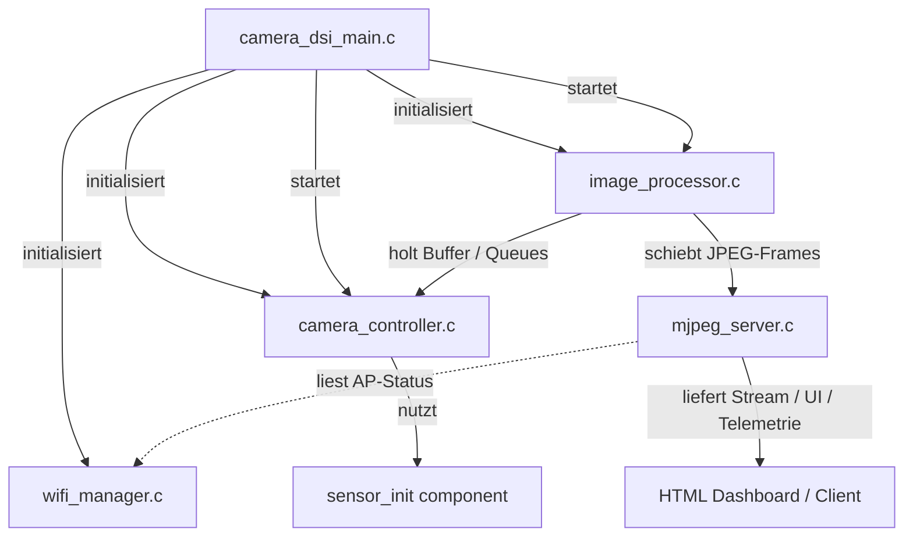

# Systemarchitektur & Datenfluss (ESP32-P4 Webcam)

Dieses Dokument beschreibt die Softwarearchitektur, die Zuständigkeiten der einzelnen Quellcodedateien, ihre Beziehungen untereinander sowie den detaillierten Fluss der Kamerabilder vom MIPI CSI-2 Sensor bis zum Webbrowser des Endbenutzers.

---

## 1. Modulübersicht und Zuständigkeiten

Das Projekt besteht aus fünf C-Dateien im Verzeichnis `main` sowie einem Initialisierungsmodul für den Kamerasensor. Jedes Modul erfüllt eine klar abgegrenzte Aufgabe:

```
ESP32-P4 Webcam Project
├── main
│   ├── camera_dsi_main.c   <- App-Eintrittspunkt und globale Initialisierung
│   ├── wifi_manager.c      <- WLAN-Konfiguration, Verbindungsaufbau & Auto-Reconnect
│   ├── camera_controller.c <- Kamera-Hardware (LDO, MIPI CSI, ISP, DMA-Buffer)
│   ├── image_processor.c   <- Bildtransformation (PPA) und JPEG-Komprimierung (Hardware)
│   └── mjpeg_server.c      <- HTTP-Server, MJPEG-Streamer, Status-API & Dashboard UI
└── components
    └── sensor_init         <- SCCB/I2C Erkennung und Initialisierung des Bildsensors
```

### 1.1. camera_dsi_main.c (Einstiegspunkt)
* **Zuständigkeit:** Enthält die Funktion `app_main(void)`. Sie steuert die globale Initialisierungsreihenfolge des ESP32-P4.
* **Ablauf:**
  1. Initialisiert den NVS-Flash (wird für WLAN-Konfigurationen benötigt).
  2. Startet den WLAN-Verbindungsaufbau über den `wifi_manager`.
  3. Initialisiert die Kamera-Hardware über den `camera_controller`.
  4. Bereitet die Bildverarbeitungspipeline und den Webserver über den `image_processor` vor.
  5. Startet den Verarbeitungs-Task und gibt den Stream der Kamera frei.
  6. Verbleibt in einer Überwachungsschleife (Main-Loop).

### 1.2. wifi_manager.c (WLAN-Verbindung)
* **Zuständigkeit:** Konfiguriert das WLAN im Station-Modus (STA), verbindet sich mit dem konfigurierten Access Point und überwacht die Verbindung.
* **Besonderheiten:** Implementiert eine robuste Wiederverbindungsschleife. Bricht die Verbindung ab (oder ist der Router beim Start offline), versucht das Modul im Hintergrund unendlich weiter, die Verbindung herzustellen, ohne den Start der Kamera oder des Webservers zu blockieren.

### 1.3. camera_controller.c (Kamera-Treiber & DMA)
* **Zuständigkeit:** Steuert die physische Schnittstelle zur Kamera.
* **Ablauf & Hardware-Nutzung:**
  * Schaltet den LDO-Regulator für die MIPI-PHY des ESP32-P4 ein.
  * Startet die SCCB/I2C-Kommunikation zur Kamera, um den Sensor (RAW8, 800x800, 50 FPS) zu konfigurieren.
  * Richtet den MIPI CSI-2 Controller und den integrierten ISP (Image Signal Processor) ein. Der ISP debayert das RAW8-Bild zu RGB565.
  * Verwaltet einen DMA-Doppelpuffer (`frame_buffers[2]`) im PSRAM (SPIRAM), um reibungsfreie Transfers ohne Tearing zu gewährleisten.
  * Bietet ISR-Callbacks (`on_get_new_trans`, `on_trans_finished`), um fertige Bilder an die Verarbeitungs-Queue zu senden. Ist der Verarbeitungs-Task überlastet, werden Frames in einen dedizierten `discard_buffer` verworfen.

### 1.4. image_processor.c (Bildverarbeitung)
* **Zuständigkeit:** Empfängt die 800x800 RGB565-Frames, transformiert sie auf das Zielformat für die spätere KI-Inferenz (224x224 RGB565) und komprimiert sie für den Stream.
* **Ablauf & Hardware-Nutzung:**
  * Nutzt den **PPA (Pixel Processing Accelerator)** der ESP32-P4 Hardware, um den Crop, die Skalierung auf 224x224, die horizontale Spiegelung (`.mirror_x = true`) und das finale Abspeichern als RGB565 in einem einzigen Schritt durchzuführen.
  * Gibt den ursprünglichen Kamera-Buffer sofort wieder an den Controller frei.
  * Nutzt den integrierten **Hardware JPEG-Encoder** des ESP32-P4, um das 224x224 RGB565-Bild mit einer Qualität von 80 in ein JPEG zu komprimieren.
  * Schiebt das fertige JPEG an den MJPEG-Streaming-Server weiter.

### 1.5. mjpeg_server.c (Streaming & Webserver)
* **Zuständigkeit:** Hostet den HTTP-Server auf Port 80.
* **Ablauf & Features:**
  * Liefert die Hauptseite `/` aus (ein modernes Glassmorphic Dashboard UI).
  * Verwaltet den Live-Videostream unter `/stream` im MJPEG-Format (`multipart/x-mixed-replace`).
  * **Multi-Client fähig:** Registriert bis zu 4 Clients einzeln und verteilt eingehende Frames über ein Semaphore-Array an alle verbundenen Browser gleichzeitig, ohne dass der Stream ruckelt.
  * Bietet die Status-API unter `/status` an (JSON-Format mit Uptime, WiFi RSSI-Signalstärke, freiem SRAM und freiem SPIRAM).

---

## 2. Modul-Zusammenhang (Klassendiagramm / Beziehungen)

Das folgende Diagramm visualisiert die Abhängigkeiten und Datenflüsse zwischen den einzelnen Modulen:



---

## 3. Datenfluss der Kamerabilder

Der detaillierte Weg eines Bildes vom Sensor bis zum Endgerät durchläuft folgende Stufen hinsichtlich Format, Auflösung und Pufferort:

### 3.1. Phasen des Bilddatenflusses

```mermaid
sequenceDiagram
    autonumber
    participant Sensor as Kamera-Sensor (CSI)
    participant ISP as ISP (Hardware)
    participant SPIRAM as PSRAM (Doppelpuffer)
    participant PPA as PPA (Hardware)
    participant JPEG as JPEG-Encoder (HW)
    participant Server as MJPEG Server (Task)
    participant Browser as Webbrowser (Client)

    Sensor->>ISP: RAW8 Bayer-Daten (800x800 @ 50fps) via MIPI CSI-2
    Note over ISP: Debayering & Farbkonvertierung
    ISP->>SPIRAM: RGB565 Bilddaten (800x800, 1.28 MB) via DMA
    Note over SPIRAM: Frame in Queue signalisiert
    rect rgb(30, 30, 45)
        Note over PPA: Crop, Skalierung & Spiegelung
        SPIRAM->>PPA: Liest 800x800 RGB565 Bild
        PPA->>SPIRAM: Schreibt 224x224 RGB565 Bild (ppa_output_buffer, ~100 KB)
    end
    Note over SPIRAM: Kamera-Buffer (1.28 MB) sofort wieder frei
    rect rgb(45, 30, 30)
        Note over JPEG: Hardware-Komprimierung (Qualität: 80)
        SPIRAM->>JPEG: Liest 224x224 RGB565 Bild
        JPEG->>SPIRAM: Schreibt komprimiertes JPEG (jpeg_buffer, ~5KB - 15KB)
    end
    Server->>SPIRAM: Kopiert JPEG in Shared Buffer (s_shared_buf)
    Note over Server: Signalisiert allen Client-Semaphoren
    Server->>Browser: Sendet JPEG über HTTP Chunked Stream (/stream)
```



### 3.2. Zustandstabelle der Bilddaten

| Stufe | Komponente / Ort | Format | Auflösung | Datengröße (ca.) | Beschreibung |
|---|---|---|---|---|---|
| **1. Erfassung** | Sensor $\rightarrow$ ISP | RAW8 (Bayer) | $800 \times 800$ | $640\text{ KB}$ | Physische Datenübertragung via MIPI CSI-2 Lanes bei 50 FPS. |
| **2. Wandlung** | ISP $\rightarrow$ PSRAM | **RGB565** | $800 \times 800$ | $1,28\text{ MB}$ | Debayering im Hardware-ISP, Speicherung via DMA in `frame_buffers[i]`. |
| **3. Inferenz-Vorbereitung** | PPA $\rightarrow$ PSRAM | **RGB565** | $224 \times 224$ | $100\text{ KB}$ | Hardware-PPA schneidet das Bild zentriert zu, spiegelt es und skaliert es herunter in den `ppa_output_buffer`. (Hier kann deine KI-Inferenz später ansetzen). |
| **4. Komprimierung** | JPEG-Encoder $\rightarrow$ PSRAM | **JPEG** | $224 \times 224$ | $5\text{ KB} - 15\text{ KB}$ | Der Hardware-JPEG-Encoder komprimiert das RGB565-Bild und legt das Ergebnis im `jpeg_buffer` ab. |
| **5. Verteilung** | Server $\rightarrow$ Client | **JPEG** (HTTP Chunk) | $224 \times 224$ | $5\text{ KB} - 15\text{ KB}$ | Das Bild wird in einen geteilten Puffer kopiert und parallel an alle HTTP-Sockets gestreamt. |

---

## 4. Puffer- und Speichermanagement

Durch die Verwendung der Hardwarebeschleuniger des ESP32-P4 (ISP, PPA, JPEG) und intelligentem FreeRTOS-Queuing wird der Kopiervorgang per CPU auf ein Minimum reduziert:

1. **Ringbuffer für DMA:** Der `camera_controller` stellt dem CSI-DMA-Controller immer einen freien Buffer aus dem `xBufferPool` zur Verfügung.
2. **Zero-Copy Freigabe:** Nach dem Einlesen des Frames durch den PPA in [image_processor.c](file:///home/andreas/source/ESP32p4webcam/main/image_processor.c) wird der 1.28 MB große Original-Buffer sofort wieder in den Pool gegeben – noch während der JPEG-Encoder und der Webserver mit dem kleineren 224x224 Buffer beschäftigt sind.
3. **Ausfallsicherheit:** Findet der Controller bei einem neuen Frame keinen freien Buffer im Pool vor (weil der Verarbeitungs-Task blockiert ist), schreibt der DMA in einen `discard_buffer`, um Speicherüberschreibungen und Speicherlecks zu verhindern.
